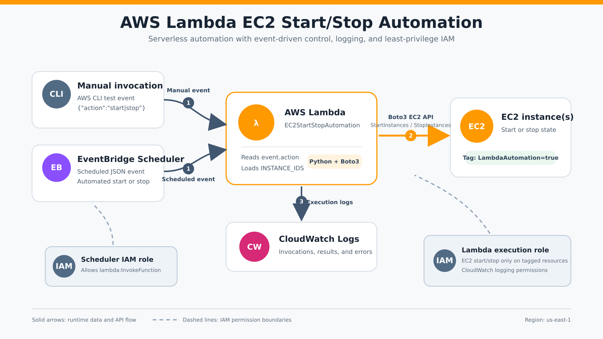
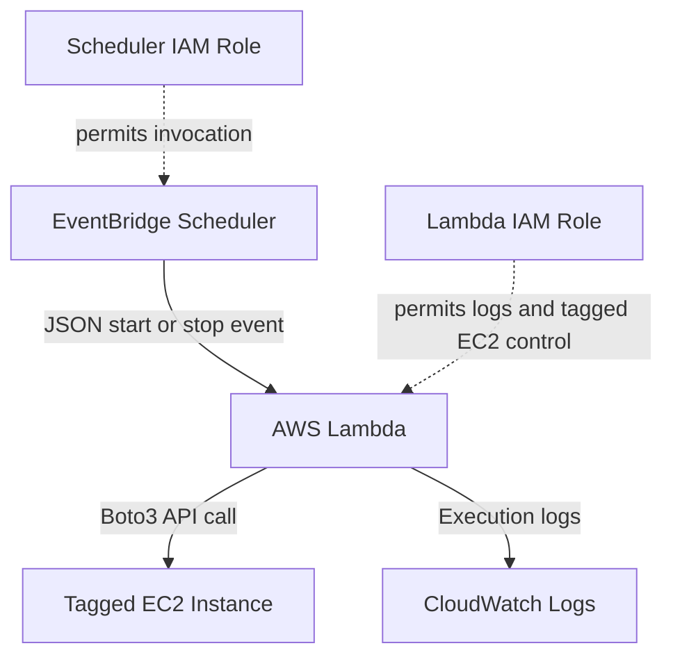

# AWS Lambda EC2 Start/Stop Automation

Serverless AWS automation that starts or stops selected EC2 instances through scheduled or manual events. The project uses AWS Lambda, Python/Boto3, IAM, CloudWatch Logs, and EventBridge Scheduler, with tag-based access controls and cost-conscious cleanup.

> Public repository note: the IAM and Scheduler JSON files use `ACCOUNT_ID`
> placeholders. Replace them only in your private deployment copy. Never commit
> AWS credentials or private account configuration.

## Project Summary

This project automates a common Cloud Operations task: controlling EC2 instance state without manually signing in to the AWS console. EventBridge Scheduler sends a JSON event to Lambda, the Lambda function reads the requested action, and Boto3 calls the EC2 API. IAM policies limit each component to the permissions it needs.

The final workflow was tested successfully from end to end. A scheduled event invoked Lambda and changed the test EC2 instance from `stopped` to `running`. The test schedule was then deleted and the instance was stopped to avoid unnecessary charges.

## Architecture



The diagram shows both manual and scheduled invocation paths, the separate IAM roles, Lambda-to-EC2 control, and CloudWatch logging.



## AWS Services and Tools

- AWS Lambda with Python 3.13
- Amazon EC2
- AWS Identity and Access Management (IAM)
- Amazon CloudWatch Logs
- Amazon EventBridge Scheduler
- Python and Boto3
- AWS CLI
- Ubuntu on WSL 2
- Bash, JSON, Nano, Git, and GitHub

## Key Features

- Starts or stops one or more EC2 instances.
- Accepts the requested action from the invocation event.
- Uses a safe default of `stop` when no action is supplied.
- Restricts EC2 control to resources tagged `LambdaAutomation=true`.
- Uses separate IAM roles for Lambda and EventBridge Scheduler.
- Writes invocation and troubleshooting evidence to CloudWatch Logs.
- Supports both manual AWS CLI tests and scheduled execution.
- Includes cleanup steps to reduce ongoing AWS costs.

## Project Structure

```text
AWS-Lambda-EC2-Automation/
├── src/
│   └── lambda_function.py
├── policies/
│   ├── lambda-trust-policy.json
│   ├── ec2-control-policy.json
│   ├── scheduler-trust-policy.json
│   └── scheduler-invoke-lambda-policy.json
├── scheduler/
│   └── start-target.json
├── screenshots/
├── .gitignore
├── lambda_function.zip
└── README.md
```

## Lambda Function

```python
import boto3
import os

ec2 = boto3.client("ec2")


def lambda_handler(event, context):
    instance_ids = os.environ["INSTANCE_IDS"].split(",")
    action = event.get("action", os.environ.get("ACTION", "stop")).lower()

    if action == "start":
        ec2.start_instances(InstanceIds=instance_ids)
    elif action == "stop":
        ec2.stop_instances(InstanceIds=instance_ids)
    else:
        raise ValueError("ACTION must be 'start' or 'stop'")

    return {
        "statusCode": 200,
        "message": f"Successfully requested EC2 instances to {action}",
        "instance_ids": instance_ids,
    }
```

### How the Code Works

1. `boto3.client("ec2")` creates a low-level EC2 service client.
2. `INSTANCE_IDS` is read from a Lambda environment variable and converted into a Python list.
3. The function first checks the event for `action`.
4. If the event does not contain an action, the function checks the `ACTION` environment variable.
5. If neither value exists, the function safely defaults to `stop`.
6. Boto3 calls either the `StartInstances` or `StopInstances` EC2 API.
7. The handler returns a status code, result message, and target instance IDs.

## IAM and Security Design

The Lambda execution role, `LambdaEC2AutomationRole`, uses:

- `AWSLambdaBasicExecutionRole` for CloudWatch Logs.
- A custom inline policy allowing only `ec2:StartInstances` and `ec2:StopInstances`.
- A resource-tag condition requiring `LambdaAutomation=true`.

The EventBridge Scheduler role, `EventBridgeSchedulerLambdaRole`, uses a separate inline policy that permits `lambda:InvokeFunction` only for this project’s Lambda function.

This design demonstrates least privilege: Scheduler can invoke only the intended function, while Lambda can control only tagged EC2 instances and write its logs.

## Deployment and Validation

Validate the Python syntax:

```bash
python3 -m py_compile src/lambda_function.py
```

Build the deployment package:

```bash
zip -j lambda_function.zip src/lambda_function.py
```

Upload corrected code:

```bash
aws lambda update-function-code \
  --function-name EC2StartStopAutomation \
  --zip-file fileb://lambda_function.zip \
  --region us-east-1
```

Test a manual start event:

```bash
aws lambda invoke \
  --function-name EC2StartStopAutomation \
  --region us-east-1 \
  --cli-binary-format raw-in-base64-out \
  --payload '{"action":"start"}' \
  response.json
```

Test a manual stop event:

```bash
aws lambda invoke \
  --function-name EC2StartStopAutomation \
  --region us-east-1 \
  --cli-binary-format raw-in-base64-out \
  --payload '{"action":"stop"}' \
  response.json
```

Inspect the handler response:

```bash
cat response.json
```

## Main Troubleshooting Story

### Symptom

EventBridge Scheduler invoked the Lambda function every minute, and CloudWatch Logs confirmed successful invocations, but the EC2 instance remained stopped.

### Investigation

I compared the current source file with the code inside the deployed ZIP package. The deployed handler still used only the environment variable:

```python
action = os.environ.get("ACTION", "stop").lower()
```

That code ignored the Scheduler event payload, so every scheduled invocation continued using the default action of `stop`.

### Fix

I changed the handler to prioritize the event value:

```python
action = event.get("action", os.environ.get("ACTION", "stop")).lower()
```

I then validated the Python file, rebuilt the ZIP package, redeployed the function, and repeated the manual and scheduled tests.

### Result

The corrected EventBridge schedule invoked Lambda, Lambda read `{"action":"start"}`, and Boto3 successfully changed the tagged EC2 instance from `stopped` to `running`.

## Additional Problems Solved

- Distinguished Windows PowerShell from Ubuntu/WSL Bash commands.
- Corrected malformed IAM JSON, including an invalid leading space in the policy version.
- Corrected a mistyped Systems Manager public parameter name.
- Corrected an incomplete AWS Region value from `us-east` to `us-east-1`.
- Resolved case-sensitive Lambda and EventBridge schedule name errors.
- Learned that several successful AWS CLI commands return no output.
- Verified that HTTP-style Lambda `StatusCode: 200` should be followed by inspection of the handler response file.

## Verification Evidence

Add these representative screenshots to the `screenshots/` directory after
cropping or hiding account IDs, full ARNs, public IP addresses, and other
sensitive values:

| Screenshot | Evidence |
|---|---|
| `14-eventbridge-start-schedule-created-cli.png` | Initial EventBridge schedule creation |
| `15-eventbridge-scheduler-cloudwatch-invocations.png` | Scheduler-triggered Lambda logs |
| `16-eventbridge-final-schedule-created.png` | Corrected final schedule ARN |
| `17-eventbridge-automatic-start-running.png` | EC2 automatically changed to `running` |
| `18-final-ec2-stopped-cleanup.png` | Final stopped state after cleanup |

## Cleanup and Cost Control

The one-minute test schedule was deleted immediately after validation because a recurring schedule remains active until it is disabled or deleted. The EC2 test instance was also stopped after evidence was collected.

Before publishing, credentials, account identifiers, local AWS configuration, response files, caches, and installer archives must be excluded. Recommended `.gitignore` entries:

```gitignore
.aws/
awscliv2.zip
__pycache__/
*.pyc
response.json
```

## Skills Demonstrated

- Serverless automation with Lambda
- Python event handling and input validation
- AWS API calls through Boto3
- IAM trust policies and permissions policies
- Least-privilege and tag-based access control
- Scheduled automation with EventBridge Scheduler
- Monitoring and root-cause analysis with CloudWatch Logs
- Linux/WSL and AWS CLI workflows
- Deployment package management
- Operational cleanup, documentation, and cost awareness

## Interview Summary

> I built a serverless system that starts or stops selected EC2 instances using EventBridge Scheduler, Lambda, Python, and Boto3. I created separate least-privilege IAM roles, restricted EC2 control to tagged resources, and verified execution through CloudWatch Logs. During testing, Scheduler invoked Lambda but EC2 did not start. I compared the source code with the deployed ZIP and found that the deployed handler ignored the event payload. I corrected the event-handling logic, rebuilt and redeployed the package, and verified the complete scheduled workflow. Finally, I deleted the test schedule and stopped the instance to control costs.

## Future Improvements

- Add separate production schedules for start and stop operations.
- Send execution failures to an Amazon SNS notification topic.
- Add CloudWatch alarms and a dead-letter queue for failed invocations.
- Manage the infrastructure with Terraform.
- Add automated code validation and deployment through GitHub Actions.

---

Built by John Kargbo as part of an AWS cloud engineering portfolio.
